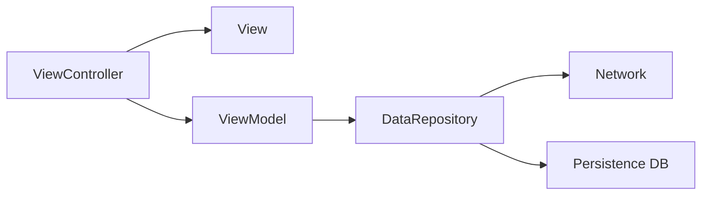

# Workouter
**iOS Project Implemented with MVVM Architecture and RxSwift** 

**Main Feature : Workout Traker, Gym Log** 

**App Store Link :** <a href="https://apps.apple.com/kr/app/workouter-workout-tracker-log/id6447367318" target="_blank">Workouter - Workout Traker Log</a>

## Layers
-  Presentation Layer = View + ViewController ( Separated )
- Domain Layer = ViewModel ( Business Logic )
-  Data Repository Layer = Repositories Implementations + Network + Persistence DB

**Dependency Direction**

## Includes
- Reactive Functional Programming with RxSwift
- Code Base UI with Snapkit (Refactored from storyboard)
- Separated View and View Controller
- Expandable ( Collapsable ) Table View
- GIF Image
- Dark Mode
- SwiftUI Preview
- UI Factory Pattern <a href="https://github.com/JongHyunLee84/Workouter/blob/main/Workouter/Utilities/UI/UIFactory.swift" target="_blank">(Workouter.UIFactory)</a>
- Repository Pattern <a href="https://github.com/kudoleh/iOS-Clean-Architecture-MVVM/tree/master/ExampleMVVM/Domain/Interfaces/Repositories" target="_blank">(Reference)</a>
- Base View Pattern <a href="https://github.com/JongHyunLee84/Workouter/blob/main/Workouter/Utilities/UI/BaseUI/BaseViewController.swift" target="_blank">(ex. BaseViewController)</a>
## Framework and Library
- UIKit
- Snapkit : Layout
- RxSwift / RxCocoa : Reactive Functional Programming
- GIFLibrary : <a href="https://github.com/kiritmodi2702/GIF-Swift/blob/master/GIF-Swift/iOSDevCenters+GIF.swift" target="_blank">Reference</a>
- CoreData : Persistence DB

**Network(Data) API**  :  <a href="https://rapidapi.com/justin-WFnsXH_t6/api/exercisedb/" target="_blank">ExerciseDB</a>
## Build
1. git clone
2. pod install (update)
3. open .xcworkspace project
