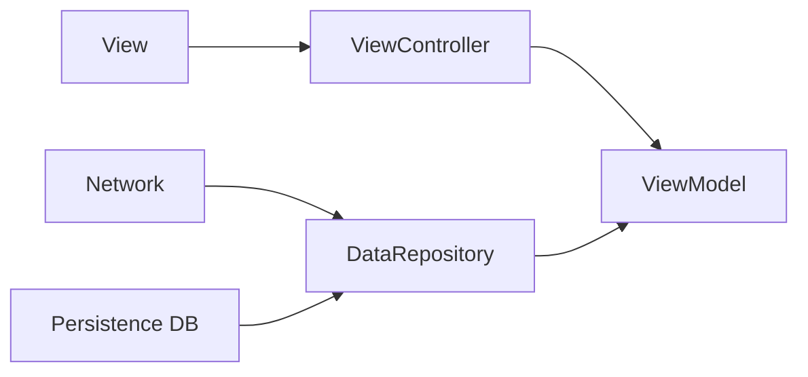

# Workouter

Main Feature : Workout Traker, Gym Log 

iOS Project implemented with MVVM Architecture and RxSwift

App Store Link: [Workouter - Workout Traker Log](https://apps.apple.com/kr/app/workouter-workout-tracker-log/id6447367318)

## Layers
-  Presentation Layer = View + ViewController ( Separated )
- Domain Layer = ViewModel ( Business Logic )
-  Data Repository Layer = Repositories Implementations + Network + Persistence DB

**Dependency Direction**

## Includes
- Reactive Functional Programming with RxSwift
- Code Base UI with Snapkit (Refactored from storyboard)
- Separated View and View Controller
- Expandable ( Collapsible ) Table View
- GIF Image
- Dark Mode
- UI Factory Pattern [(Code Here)](https://github.com/JongHyunLee84/Workouter/blob/main/Workouter/Utilities/UI/UIFactory.swift)
- Repository Pattern [(Reference)](https://github.com/kudoleh/iOS-Clean-Architecture-MVVM)
- Base View Pattern [(ex. BaseViewController)](https://github.com/JongHyunLee84/Workouter/blob/main/Workouter/Utilities/UI/BaseUI/BaseViewController.swift)

